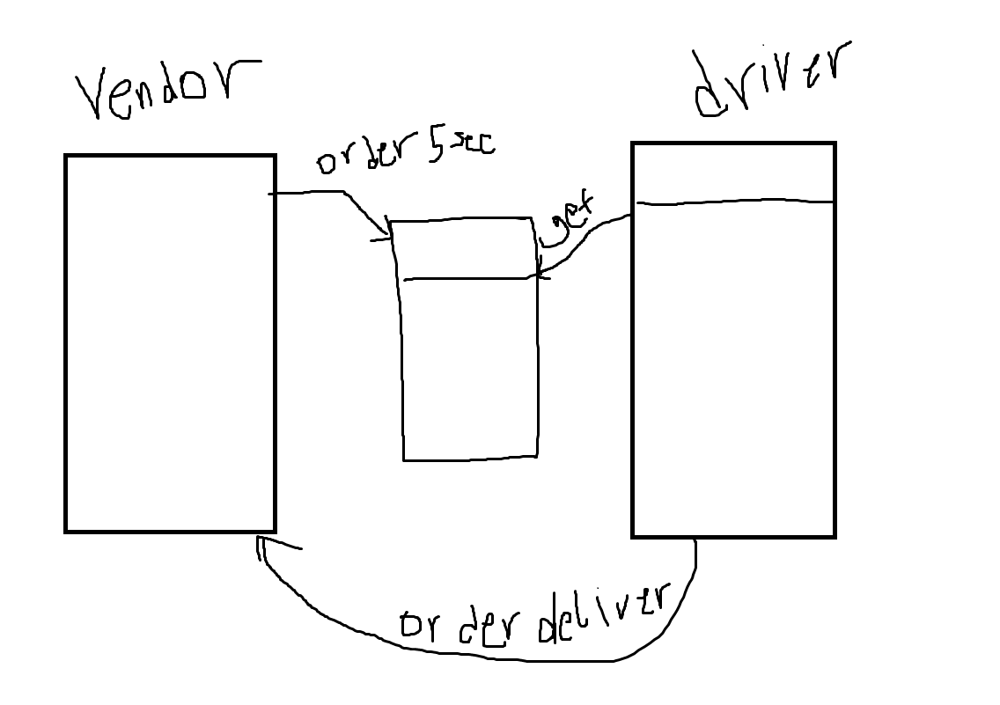

# CAPS-SNS-SQS

Required Services

SNS Topic: pickup which will receive all pickup requests from vendors
SQS Queue (FIFO): packages which will contain all delivery requests from vendors, in order of receipt.
Subscribe this queue to the pickup topic so all pickups are ordered
SQS Queue (Standard) for each vendor (named for the vendor) which will contain all delivery notifications from the drivers

